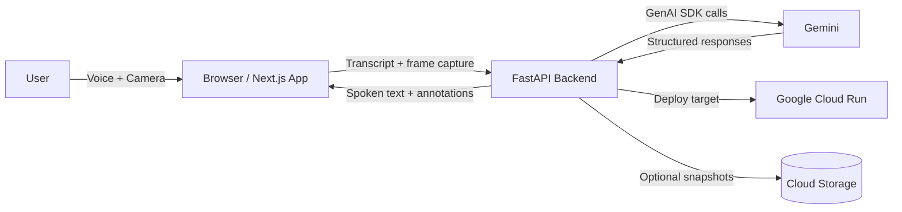

# Reality Copilot

**A live voice-and-vision assistant for the real world.**

Reality Copilot is a production-style MVP for the **Gemini Live Agent Challenge** (“Live Agents” category). It delivers an honest real-time experience: live voice conversation, camera-aware analysis with Gemini, freeze-frame explain mode, and lightweight visual overlays.

## 1) Project Overview
Reality Copilot lets users talk naturally while showing a live camera scene. The assistant responds with concise spoken guidance and visual highlights, while explicitly communicating uncertainty when visual evidence is weak.

## 2) Challenge Category Qualification
This qualifies for the **Live Agents** category because it provides:
- Live conversational loop with interruption-ready UX
- Real camera grounding (on-demand + freeze-frame)
- Structured annotations rendered as overlays
- Gemini-backed analysis and conversational responses
- Cloud Run deployment path on Google Cloud

## 3) Feature List
- 🎙️ Live voice interaction in-browser (speech recognition input + TTS output fallback)
- 📷 Camera-first interface with premium glassmorphism UI
- 🧊 Freeze-and-explain mode for stable visual grounding
- 🧠 Gemini visual analysis with strict JSON schema parsing
- 🗂️ Scene insights panel and live transcript history
- 🧭 Session states: idle, connecting, listening, speaking, analyzing, thinking, error
- 🧱 Optional snapshot artifact upload to Google Cloud Storage

## 4) Architecture Overview
See [docs/architecture.md](docs/architecture.md).



## 5) Tech Stack
- **Frontend:** Next.js App Router, TypeScript, Tailwind CSS, Framer Motion, lucide-react
- **Backend:** FastAPI, Pydantic, Google GenAI SDK
- **Cloud:** Google Cloud Run (required), optional Cloud Storage
- **Testing:** Pytest (schema/parser validation)

## 6) Setup Instructions
### Prerequisites
- Node.js 20+
- Python 3.11+
- Google Gemini API key (AI Studio) and optionally GCP project access

### Clone and env
```bash
cp .env.example .env
```
Edit `.env` and fill `GEMINI_API_KEY`.

## 7) Environment Variables
Key variables in `.env.example`:
- `GEMINI_API_KEY`: required for real model calls
- `GEMINI_MODEL`: default `gemini-2.5-flash`
- `NEXT_PUBLIC_API_BASE_URL`: frontend -> backend base URL
- `ENABLE_GCS_SNAPSHOTS`: `true/false`
- `GCP_PROJECT_ID`, `GCS_BUCKET`: only when snapshot storage enabled

## 8) Local Development
### Backend
```bash
cd backend
python -m venv .venv && source .venv/bin/activate
pip install -r requirements.txt
uvicorn app.main:app --reload --port 8000
```

### Frontend
```bash
cd frontend
npm install
npm run dev
```

Open:
- Frontend: http://localhost:3000
- Backend health: http://localhost:8000/api/health

## 9) Deployment (Google Cloud Run)
Use the provided helper:
```bash
PROJECT_ID=your-project-id GEMINI_API_KEY=your-key scripts/deploy-cloud-run.sh
```

Or manually:
1. Build backend image with Cloud Build
2. Deploy Cloud Run service with env vars
3. Point frontend `NEXT_PUBLIC_API_BASE_URL` to Cloud Run URL

## 10) How Gemini Is Used
- `POST /api/audio/transcript`: concise conversational response from Gemini text generation
- `POST /api/vision/analyze`: multimodal image + prompt analysis with strict grounded system prompt
- Structured output fields:
  - `spoken_text`
  - `summary_text`
  - `scene_description`
  - `annotations[]` (normalized bounding boxes + label + note + priority)
  - `uncertainty`
  - `follow_up_suggestion`

## 11) Suggested Demo Flow
1. Open landing page and launch app
2. Start session and grant mic/camera permissions
3. Ask: “What do you see right now?”
4. Run **Analyze Frame**
5. Freeze frame and ask follow-up: “What should I focus on?”
6. Show overlays + scene insights + spoken response
7. Mention uncertainty handling when frame is blurry

## 12) Limitations and Honest Notes
- Browser speech recognition + browser TTS are used for robust demoability.
- Native bidirectional Gemini Live audio streaming can be added behind the existing service adapter.
- Frame grounding is explicit/on-demand (and freeze mode), not fake continuous per-frame understanding.

## 13) Future Improvements
- Native Gemini Live streaming audio I/O over WebSocket/WebRTC
- Camera device switcher and manual ROI selection
- Session replay and stored snapshot timeline
- Better interruption controls with voice activity detection

## 14) Reproducibility Steps
1. Clone repo and set `.env`
2. Run backend and frontend locally
3. Validate `/api/health`
4. Start session in `/app`
5. Trigger frame analysis and observe overlays
6. Run tests with `pytest`

---

## Repository Structure
```
frontend/
backend/
docs/
docker/
scripts/
.env.example
README.md
```
