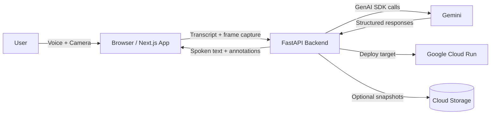

# Reality Copilot

**A live voice-and-vision assistant for the real world.**

Reality Copilot is a production-style MVP for the **Gemini Live Agent Challenge** (“Live Agents” category). It delivers an honest real-time experience with two in-app workflows: **Visual Guide** (camera-first grounded guidance) and **Interview Coach** (transcript-first communication coaching with optional frame context).

## 1) Project Overview
Reality Copilot lets users talk naturally while showing a live camera scene. The assistant responds with concise spoken guidance and visual highlights, while explicitly communicating uncertainty when visual evidence is weak.

## 2) Challenge Category Qualification
This qualifies for the **Live Agents** category because it provides:
- Live conversational loop with interruption-ready UX
- Real camera grounding (on-demand + freeze-frame)
- Structured annotations rendered as overlays
- Gemini-backed analysis and conversational responses
- Cloud Run deployment path on Google Cloud

## 3) Feature List
### 🚀 Reality Copilot 2.0 - Auto Intelligence Edition

#### **Core Features**
- 🎙️ **Live voice interaction** with natural speech recognition and TTS
- 🧭 **Dual modes**: **Visual Guide** (camera-first) and **Interview Coach** (transcript-first)
- 📷 **Premium camera interface** with glassmorphism UI
- 🧊 **Freeze-and-explain** mode for stable visual grounding
- 🧠 **Gemini-powered analysis** with structured JSON outputs

#### **🆕 Auto Intelligence Features**
- ⏰ **Continuous analysis** every 60 seconds when enabled
- 🎤 **Voice commands** for hands-free control:
  - "Reality, analyze frame" → Instant analysis
  - "Reality, freeze" → Freeze/unfreeze video
  - "Reality, auto on/off" → Toggle continuous analysis
  - "What do you see?" → Auto-trigger analysis
  - "Clear overlays" → Remove annotations
- 🤖 **Proactive AI assistance** with contextual triggers
- 📜 **Auto-scrolling transcript** to latest messages
- 📋 **Collapsible timeline** dropdown (space-saving)
- 🎯 **Single-page layout** - everything fits on one screen

#### **UI/UX Enhancements**
- 🎨 **Professional judge-ready design** - no scrolling required
- 📱 **Responsive layout** with video + transcript side-by-side
- 🔊 **Improved TTS voice quality** with natural pacing
- 🎛️ **Enhanced controls** with visual feedback
- 📊 **Quality indicators** and status badges
- 🧹 **Clean, minimal aesthetic**

#### **Technical Improvements**
- 🔧 **Better error handling** and debugging
- 🌐 **Network connectivity testing** and fallbacks
- 🔒 **Proper session cleanup** (mic turns off when ending)
- 📹 **Enhanced camera permissions** handling
- 🚀 **Production-ready deployment** configurations

## 4) Architecture Overview
See [docs/architecture.md](docs/architecture.md).


```mermaid
flowchart LR
  U[User] -->|Voice + Camera| B[Browser / Next.js App]
  B -->|Transcript + frame capture| A[FastAPI Backend]
  A -->|GenAI SDK calls| G[Gemini]
  G -->|Structured responses| A
  A -->|Spoken text + annotations| B
  A -->|Deploy target| R[Google Cloud Run]
  A -->|Optional snapshots| S[(Cloud Storage)]
```

## 5) Tech Stack
- **Frontend:** Next.js App Router, TypeScript, Tailwind CSS, Framer Motion, lucide-react
- **Backend:** FastAPI, Pydantic, Google GenAI SDK
- **Cloud:** Google Cloud Run (required), optional Cloud Storage
- **Testing:** Pytest (schema/parser validation)

## 6) Setup Instructions
### Prerequisites
- Node.js 20+
- Python 3.11+
- Google Gemini API key (AI Studio) and optionally GCP project access

### Clone and env
```bash
cp .env.example .env
```
Edit `.env` and fill `GEMINI_API_KEY`.

## 7) Environment Variables
Key variables in `.env.example`:
- `GEMINI_API_KEY`: required for real model calls
- `GEMINI_MODEL`: default `gemini-2.5-flash`
- `NEXT_PUBLIC_API_BASE_URL`: frontend -> backend base URL
- `ENABLE_GCS_SNAPSHOTS`: `true/false`
- `GCP_PROJECT_ID`, `GCS_BUCKET`: only when snapshot storage enabled

## 8) Local Development
### Backend
```bash
cd backend
python -m venv .venv && source .venv/bin/activate
pip install -r requirements.txt
uvicorn app.main:app --reload --port 8000
```

### Frontend
```bash
cd frontend
npm install
npm run dev
```

Open:
- Frontend: http://localhost:3000
- Backend health: http://localhost:8000/api/health

## 9) Deployment

### 🚀 Quick Deployment Options

#### **Option 1: Google Cloud Run (Recommended)**
Full app in one container - easiest for demos and hackathons:
```bash
# Set your credentials
export PROJECT_ID="your-gcp-project-id"
export GEMINI_API_KEY="your-gemini-api-key"

# Deploy with script
./deploy-cloudrun.sh
```

#### **Option 2: Vercel + Separate Backend**
Production-ready with global CDN:
```bash
# Deploy frontend to Vercel
vercel --prod

# Deploy backend to Railway/Render/Cloud Run
# See DEPLOYMENT.md for detailed instructions
```

### 📋 Deployment Files Included
- `vercel.json` - Vercel configuration
- `Dockerfile` - Multi-stage build for Cloud Run
- `deploy-cloudrun.sh` - Automated Cloud Run deployment
- `DEPLOYMENT.md` - Complete deployment guide

### 🔧 Environment Variables Required
- `GEMINI_API_KEY` - Your Gemini API key (required)
- `NEXT_PUBLIC_API_BASE_URL` - Backend URL (for frontend)
- `PORT` - Application port (default: 8080)

### 🌐 Access Your Deployed App
After deployment, your app will be available at the provided URL with full functionality including:
- Voice commands and continuous analysis
- Camera feed and visual overlays  
- Interview coaching and visual guidance
- Professional single-page UI

## 10) How Gemini Is Used
- `POST /api/audio/transcript`: concise conversational response from Gemini text generation
- `POST /api/vision/analyze`: mode-aware analysis
  - `visual_guide`: multimodal scene understanding with annotations
  - `interview_coach`: transcript-first coaching with optional frame context
- Visual Guide output fields:
  - `spoken_text`, `summary_text`, `scene_description`, `annotations[]`, `uncertainty`, `follow_up_suggestion`
- Interview Coach output fields:
  - `spoken_feedback`, `summary`, `strengths`, `weaknesses`, `filler_word_count`, `pacing_hint`, `structure_feedback`, `example_feedback`, `improved_answer`, `overall_score`, `confidence_note`

## 11) Suggested Demo Flow
### Visual Guide (current scene coaching)
1. Open landing page and launch app
2. Start session and grant mic/camera permissions
3. Ask: “What do you see right now?”
4. Run **Analyze frame**
5. Freeze frame and ask follow-up: “What should I focus on?”
6. Show overlays + scene insights + spoken response

### Interview Coach (transcript-first practice)
1. Switch to **Interview Coach** mode
2. Optionally pick a preset question
3. Answer out loud for ~20–30 seconds
4. Click **Coach My Answer**
5. Show strengths, weaknesses, pacing hint, improved answer, and rubric score

## 12) Limitations and Honest Notes
- Browser speech recognition + browser TTS are used for robust demoability.
- Native bidirectional Gemini Live audio streaming can be added behind the existing service adapter.
- Frame grounding is explicit/on-demand (and freeze mode), not fake continuous per-frame understanding.
- Interview Coach is transcript-first by design; frame context is optional and limited to obvious visible setup cues (no deep emotional inference or hiring prediction claims).

## 13) Future Improvements
- Native Gemini Live streaming audio I/O over WebSocket/WebRTC
- Camera device switcher and manual ROI selection
- Session replay and stored snapshot timeline
- Better interruption controls with voice activity detection

## 14) Reproducibility Steps
1. Clone repo and set `.env`
2. Run backend and frontend locally
3. Validate `/api/health`
4. Start session in `/app`
5. Trigger frame analysis and observe overlays
6. Run tests with `pytest`

---

## Repository Structure
```
frontend/
backend/
docs/
docker/
scripts/
.env.example
README.md
```
