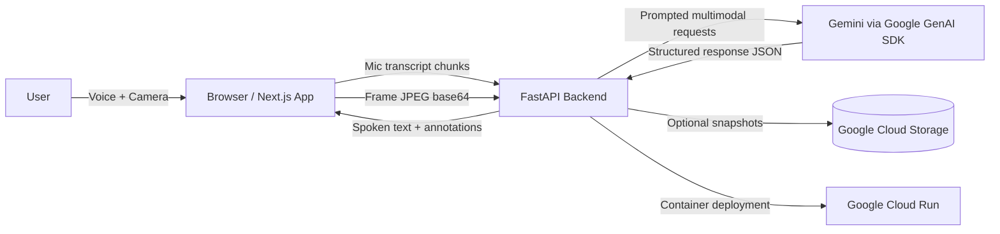

# Reality Copilot Architecture

```mermaid
flowchart LR
  U[User] -->|Voice + Camera| B[Browser / Next.js App]
  B -->|Mic transcript chunks| A[FastAPI Backend]
  B -->|Frame JPEG base64| A
  A -->|Prompted multimodal requests| G[Gemini via Google GenAI SDK]
  G -->|Structured response JSON| A
  A -->|Spoken text + annotations| B
  A -->|Optional snapshots| S[(Google Cloud Storage)]
  A -->|Container deployment| C[Google Cloud Run]
```
